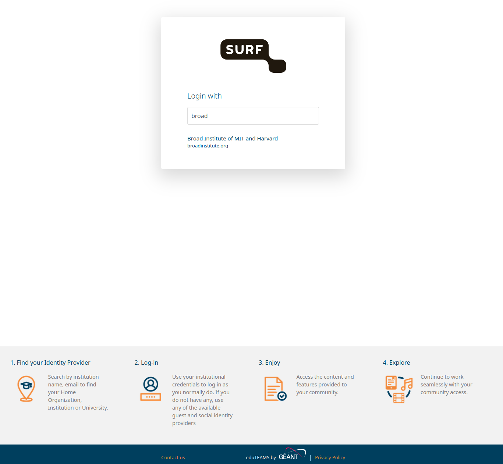

# AGH Getting Started


------------------------
## Quick Overview

The Alzheimer Genetics Hub (AGH) is a secure compute environment based largely from a clone of the Spider cluster at SURF.

------------------------
## Step 1. Join the Collaborative Organization

The collaborative organization manages your access to the AGH. T
- To join, accept the invitation e-mail you received. By clicking the button, you get a welcome message. 
- Next, click login. You will be redirected to a search page in which you can search for your institute.
  You have two options:
  1. [PREFERRED] Login through your instutional account on which you received your invitation. To search the correct link,
  enter the name of your institute in the text box. Many institutes have already been linked. If yours is not among them, 
  let us know!
  
  >[!NOTE]
  > After logging in, it is possible that you receive a message that your institute has not activated access to 
  > SURF Research Access Management (SRAM). In that case, you need to contact your ICT helpdesk. Store the information in the 
  > error message in a screen shot, and mention that you want to request that the IdP service of your institute is 
  > activated/linked to SRAM. You can also refer the helpdesk to this [link](https://dashboard.surfconext.nl/apps/8164/saml20_sp/about) for more information.
  2. [FALLBACK] If institutional access is not an option, there is the option to use the [EduID service](https://eduid.nl/en/). This provides an identity service
  for people who do not have an institutional account or when it is difficult to get institutional access activated. 
  - To find the EduID service,  enter 'EduID' in the text box that is also used to search for institutes. You will then see a list of EduID services. Select the one that is 
    appropriate for you, or otherwise 'EduID (NL)'. 
  - If you do not have an EduID account yet, you can now create one. This is a one-time process. Durint the process, you wil have to download an EduID app (offered by Surf) to enable 2-factor authentication. 
    Next, you can use your EduID account to login and join the AGHub collaboration.
- After joining the collaboration, you will get an email with your temporary login information. 
  >[!NOTE]
  > The system can take 15 minutes to sync. If you stil cannot login after 1 hour, please contact us.


------------------------
## Step 2. Set-up AGH User Account

1. Next, go to [SURF CUA portal](https://portal.cua.surf.nl).
   - Fill in the login details you received by mail, and change the auto-generated password from the e-mail.
   - You need to accept the SURF Usage agreement to obtain access to the AGHub.
   - In order to access the AGHub you need to have a file on your local computer (say, your laptop) with a private SSH key, 
     and you need to upload its matching public SSH key on the SURF CUA portal. Then, when you are going to connect to AGHub from your computer, 
     the SSH private and public keys will be compared and,   if they successfully relate to one-another, your connection will be established. Note that uploading your key to the portal is an one time task.
     <details>
       <summary>Instructions on how to generate an SSH key-pair</summary>
       ###Generating an SSH key-pair
       - [Linux,Mac] Follow the process detailed in [this link](https://spiderdocs.readthedocs.io/en/latest/Pages/ssh_keys.html). 
         By default, the key-pair is stored in the .ssh folder in your home directory. The public key is the file with the extension .pub.
       - [Windows] Windows SSH agents like [Putty](https://www.putty.org) also have functionality to [generate SSH keys](https://www.ssh.com/academy/ssh/putty/windows/puttygen).
         Your public key can be stored in a file, or copied from the GUI.
     </details>
   - Next, copy the contents of the public key file to the clipboard. 
     - On Linux, the ke-pair is stored in the .ssh folder in your home directory. The public key is the file with the extension .pub, e.g. `cat ~/.ssh/id_rsa.pub`.
     - On Windows, the public key can be stored in a file through the GUI, or can be directly copied to the clipboard from the GUI.
   - Then, go to the portal, and fill in the public key in the text box, and the password of your portal account.
     >[!IMPORTANT]
     > This is not the password which you might have associated with your privaet key, but the portal password. 
     Then, click on the button to upload the key.
2. Now, go to the [2fa website](https://2fa.surfsara.nl/) to generate a 2FA token for logging into SSH. 
   - For this, you need to install an 2FA-app on your phone. A good choice is 'privacyIDEA Authenticator'. 
   - After installing the app, you need to scan the QR code on the 2FA website. This will add an entry to the app. The app will generate a 6-digit code every 30 seconds. This code is needed to login to the AGHub. Note that you can also use the app to generate codes for other services that use 2FA, such as Google, Facebook, etc. 
   
---------------------------------
## Step 3. Logging into AGHub

1. Log into the doornode with password set in the SURF portal:
   ```bash
   ssh sram-aghub-[First initial][Last name]@doornode.surfsara.nl
   ```

2. After logging into the doornode, select aghub which should appear in a single select list.
3. Re-enter the password from the portal
4. Enter the OTP (2 factor authentication key shown in the 2FA-app) you registered earlier

If logging in succeeded you should see now the AGHub banner.

----------------------
## Step 4. Initalize your account

To facilitate setting up your account, we recommend you run the following command:

```bash

    /project/aghub/Share/init/init.sh
```


This script will do the following:

* It will copy a conda environment to your home folder, and add it to your path. This conda environment contains 
many useful packages, both general software and software for dealing with genetics data.

* It will also create a folder in your home directory `rd` which will be used to mount the
research drive. 

* It will create a bin folder in your home directory, to which it will add some useful scripts

* It will setup your bashrc, vimrc and screenrc files with useful defaults. 


The next step now is to [setup your research drive mount](agh_use_of_research_drive.md).

Afterwards, you can find out how to [install new software](agh_installing_software.md).

----------------------
## Get started with SLURM

After getting access to the cluster, please refer to our Spider documentation for submitting your first jobs:
[Spider Documentation](https://spiderdocs.readthedocs.io/en/latest/Pages/getting_started.html). 


