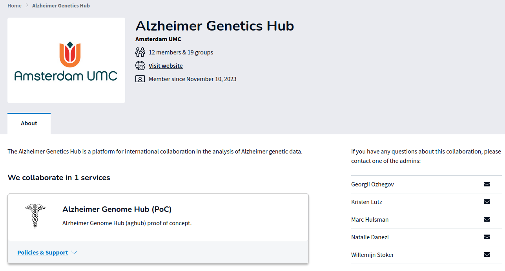

# AGH Getting Started


------------------------
## Quick Overview

The Alzheimer Genetics Hub (AGH) [https://sram.surf.nl/collaborations/672/groups/420] is a secure compute environment based largely from a clone of the Spider cluster at SURF.

Initial setup of the account requires the following:
- a link to your instutional account or an EduID account (to confirm your identity)
- a password for the AGH account + 2-factor authentication setup (using an app like privacyIDEA)
- a public SSH key uploaded to the SURF portal

Then, you can login to the AGH system, and initialize your account. 
Next, to facilitate data transfer, you will need to setup your research drive mount.

Together, this might take a bit of time, but once you are set up, usage of the system is straightforward.


------------------------
## Step 1. Join the Collaborative Organization

The collaborative organization manages your access to the AGH.
- To join, accept the invitation e-mail you received. By clicking the button, you get a welcome message. 
- Next, click login. You will be redirected to a search page in which you can search for your institute.
  You have two options:
  1. (PREFERRED) Login through your instutional account (associated with institute mail account on which you received your invitation). To search the correct link,
     enter the name of your institute in the text box. Many institutes have already been linked. If yours is not among them, 
     let us know!
     

>[!NOTE]
> After logging in, it is possible that you receive a message that your institute has not activated access to 
> SURF Research Access Management (SRAM). In that case, you need to contact your ICT helpdesk. Store the information in the 
> error message in a screen shot, and mention that you want to request that the IdP service of your institute is 
> activated/linked to SRAM. You can also refer the helpdesk to this [link](https://dashboard.surfconext.nl/apps/8164/saml20_sp/about) for more information.

>[!NOTE]
> The SRAM account requires 2-factor authentication. If your institute has not activated this, it will use the SRAM fallback method. This method uses TOTP (time-based one-time password).
> For smartphones, some links to authenticator apps are provided (privacyIDEA works well in our experience, but there are many others). If you are not able to use a smartphone, 
> note that it is also possible to install a TOTP authenticator application on your laptop (e.g. KeePassXC). 
  
  2. (FALLBACK) If institutional access is not an option, there is the option to use the [EduID service](https://eduid.nl/en/). This provides an identity service
     for people who do not have an institutional account or when it is difficult to get institutional access activated. 
     - To find the EduID service,  enter 'EduID' in the text box that is also used to search for institutes. You will then see a list of EduID services. Select the one that is 
       appropriate for you, or otherwise 'EduID (NL)'. 
     - If you do not have an EduID account yet, you can now create one. This is a one-time process. During the process, you wil have to download an EduID app (offered by Surf) to enable 2-factor authentication. 
       Next, you can use your EduID account to login and join the AGHub collaboration.
- After joining the collaboration, you will get two emails with your temporary login information.
  

>[!WARNING]
> The link in the mail is **only valid for 12 hours**.

>[!IMPORTANT]
> The system can take 20 minutes to sync. If you stil cannot login after 1 hour, please contact us.


------------------------
## Step 2. Set-up AGH User Account

1. Once you have received the emails, you need to setup the AGHub user account. 
   - You will receive a mail with your username, and a separate mail with a link to set your password. 
     Use this link to set your account password. 
>[!WARNING]
> The link is a one-time link. Do not close your browser window before you have set a new password! Note that the password
> needs to be at least 12 characters, with at least one lowercase, uppercase, digit and special character.
   - After you have set a password, you need to login. During login, you will have to setup the 2FA for the AGHub. To do this, 
     you will need to  scan a QR code with an app like privacyIDEA authenticator.  
   - The app will now generate a 6-digit code every 30 seconds. Next, you have to enter this 6-digit code to continue.
   - In the next step you will have to accept the SURF Usage agreement. 
   - Now, you are logged into the [SURF CUA portal](https://portal.cua.surf.nl). In order to access the AGHub you need to have a file on your local computer (say, your laptop) with a private SSH key, 
     and you need to upload its matching public SSH key on the SURF CUA portal. When you are going to connect to AGHub from your computer, 
     the SSH private and public keys will be compared and, if they successfully relate to one-another, your connection will be established. Note that uploading your key to the portal is an one time task.
 
     **Instructions on how to generate an SSH key-pair (only if you do not yet have one)**
       - [Linux,Mac] Follow the process detailed in [this link](https://spiderdocs.readthedocs.io/en/latest/Pages/ssh_keys.html). The 'SSH Agent' step is optional. 
         By default, the key-pair is stored in the .ssh folder in your home directory. The public key is the file with the extension .pub.
       - [Windows] Windows SSH agents like [Putty](https://www.putty.org) also have functionality to [generate SSH keys](https://www.ssh.com/academy/ssh/putty/windows/puttygen).
         Your public key can be stored in a file, or copied from the GUI.
   - Next, copy the contents of the public key file to the clipboard. 
     - On Linux, the key-pair is stored in the .ssh folder in your home directory. The public key is the file with the extension .pub, e.g. `cat ~/.ssh/id_rsa.pub`.
     - On Windows, one can use the user interface to store the public key in a file, or one can directly copy the key to the clipboard from the GUI.
   - Then, go to the portal, and fill in the public key in the text box, and the *password of your portal account*.
>[!IMPORTANT]
> This is not the password which you might have associated with your private key, but the **portal password**. 
   - Then, click on the button to upload the key.


Now you are set to login to the AGHub system. Note that it might take a bit of time for the system to sync.  
   
---------------------------------
## Step 3. Logging into AGHub

1. Log into the doornode with password set in the SURF portal:
   ```bash
   ssh sram-aghub-[First initial][Last name]@doornode.hpcv.surf.nl
   ```

2. After logging into the doornode, select aghub which should appear in a single select list.
3. Re-enter the password from the portal
4. Enter the one-time password shown in the 2FA-app (activated in step 2.2).

If logging in succeeded you should see now the AGHub banner.

----------------------
## Step 4. Initalize your account

To facilitate setting up your account, we recommend you run the following command:

```bash

    /project/aghub/Share/init/init.sh
```


This script will do the following:

* It will copy a conda environment to your home folder, and add it to your path. This conda environment contains 
many useful packages, both general software and software for dealing with genetics data.

* It will also create a folder in your home directory `rd` which will be used to mount the
research drive. 

* It will create a bin folder in your home directory, to which it will add some useful scripts

* It will setup your bashrc, vimrc and screenrc files with useful defaults. 


## Step 5. You are not done yet!

The next step now is to [setup your research drive mount](agh_use_of_research_drive.md).

Afterwards, you can find out how to [install new software](agh_installing_software.md).

----------------------
## Get started with SLURM

After getting access to the cluster, please refer to our Spider documentation for submitting your first jobs:
[Spider Documentation](https://spiderdocs.readthedocs.io/en/latest/Pages/getting_started.html). 


