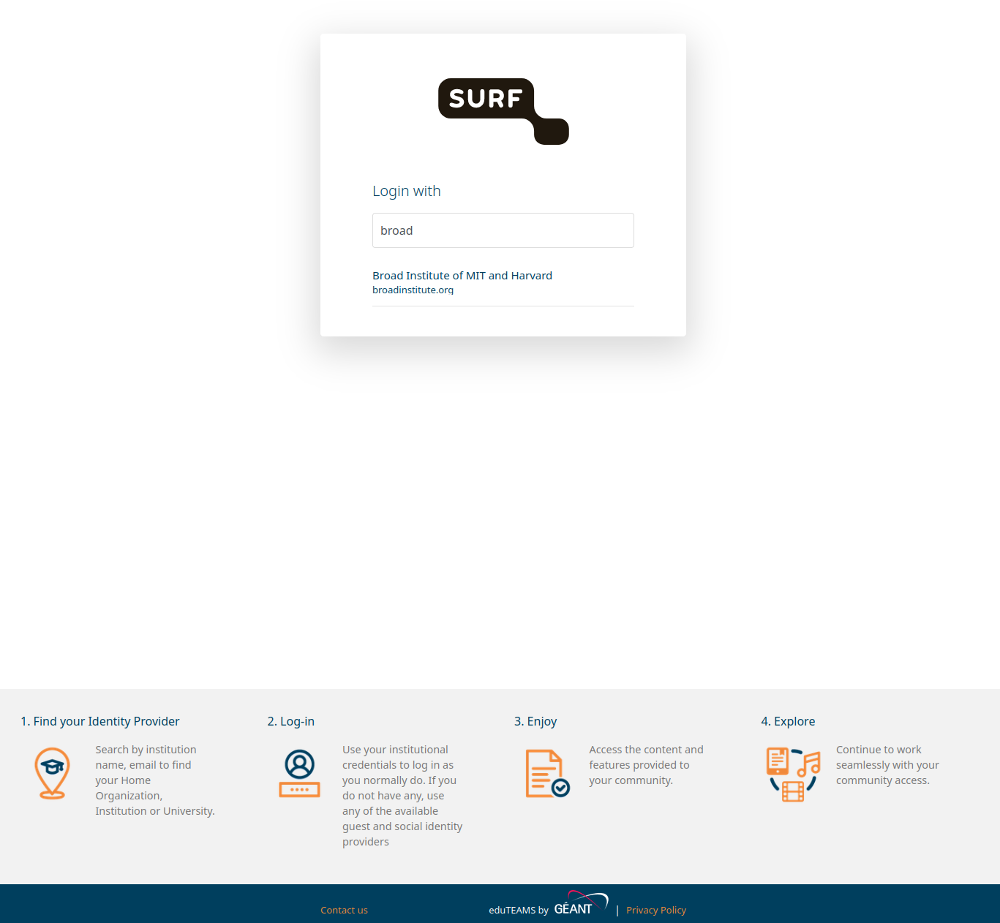
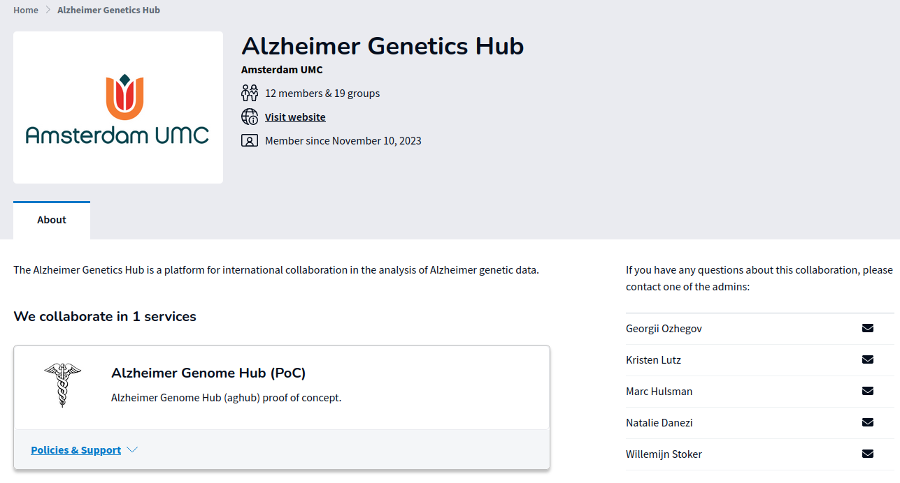

# AGHub Getting Started

This guide helps you create access and log in to AGHub for the first time.

## Before you begin

You should have:

- an invitation email for the AGHub SRAM collaboration
- two AGHub account emails (username + password setup link)
- a TOTP authenticator app (for example privacyIDEA)
- an SSH key pair on your computer (or time to create one)

## Step 1: Join the SRAM collaboration

1. Open the invitation email and accept the collaboration invite.
2. Click login and choose one identity provider:
   - **Preferred:** your institutional account
   - **Fallback:** [EduID](https://eduid.nl/en/)
3. Complete 2FA during SRAM login.



> **Note:** If your institute is not enabled for SRAM, contact your local ICT/helpdesk and ask them to enable SRAM/IdP access.

After a successful join, you receive AGHub onboarding emails.



> **Important:** The password setup link is valid for 12 hours.
> AGHub synchronization can take about 20 minutes.

## Step 2: Set your AGHub password and 2FA

1. Use the one-time password setup link from email.
2. Set a strong password (minimum 12 characters, with uppercase, lowercase, number, and symbol).
3. Log in and register your 2FA app by scanning the QR code.
4. Accept the SURF usage agreement.

> **Important:** Do not close the page before finishing the one-time password setup flow.

## Step 3: Upload your SSH public key in SURF CUA

Open the [SURF CUA portal](https://portal.cua.surf.nl) and upload your **public** key.

If you do not have an SSH key yet:

- Linux/macOS: follow [Spider SSH key guide](https://spiderdocs.readthedocs.io/en/latest/Pages/ssh_keys.html)
- Windows: use [PuTTYgen](https://www.ssh.com/academy/ssh/putty/windows/puttygen)

Show your public key on Linux/macOS:

```bash
cat ~/.ssh/id_rsa.pub
```

Paste that value into the portal SSH key field and confirm with your **portal password**.

> **Important:** Use the portal account password here, not any passphrase of your private SSH key.

## Step 4: First login to AGHub

Connect from your computer:

```bash
ssh sram-aghub-[first-initial][last-name]@doornode.hpcv.surf.nl
```

Then:

1. Select `aghub` from the environment list.
2. Enter your portal password.
3. Enter the current 2FA code.

If successful, you will see the AGHub banner.

## Step 5: Initialize your AGHub account

Run:

```bash
/project/aghub/Share/init/init.sh
```

This script sets up:

- a default Conda environment
- `~/rd` for Research Drive mounting
- useful scripts in your home `bin`
- default shell/editor/screen config files

## Next steps

1. Configure data transfer: [Use of Research Drive](research-drive.md)
2. Install extra tools if needed: [Installation of Software Packages](installing-software.md)
3. Submit your first jobs: [Spider SLURM Getting Started](https://spiderdocs.readthedocs.io/en/latest/Pages/getting_started.html)
