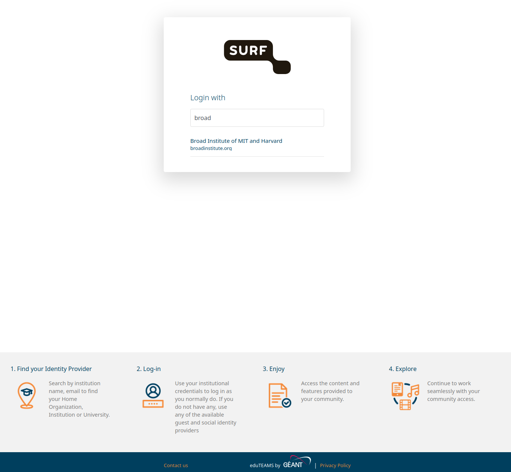
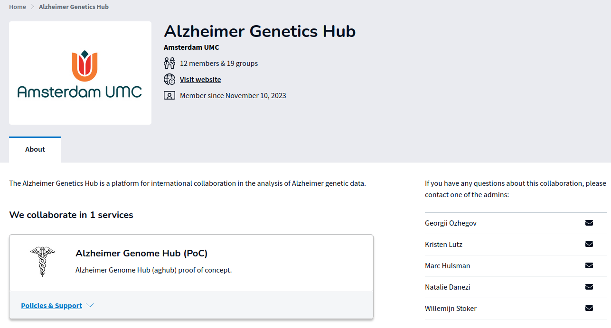

# AGHub Getting Started

This guide takes you from the invitation email to your first working AGHub
login. In short, you will:

- join the AGHub collaboration in SRAM
- set up your AGHub/SURFcua password and 2FA
- upload an SSH public key
- log in and initialize your AGHub account

The steps can take a little time because several SURF systems synchronize in the
background. Once the account is set up, normal login is straightforward.

## Before You Begin

You need:

- the invitation email for the AGHub SRAM collaboration
- two AGHub account emails from SURFcua: one with your username and one with a password setup link
- an authenticator app that can create TOTP codes, such as privacyIDEA Authenticator, Google Authenticator, Microsoft Authenticator, or KeePassXC
- an SSH key pair on the computer from which you will connect to AGHub

> **Important:** The SURFcua password setup link is valid for 12 hours and can
> be used only once. Do not close the browser tab until the password setup has
> finished.

## Step 1: Join the SRAM Collaboration

SRAM manages whether your identity is a member of the AGHub collaboration.

1. Open the AGHub collaboration invitation email.
2. Accept the invitation.
3. Click **Login**.
4. Search for your identity provider.
5. Choose one login route:
   - **Preferred:** your institutional account, using the same institute email address that received the invitation.
   - **Fallback:** [EduID](https://eduid.nl/en/), if your institute is not available or institutional login cannot be enabled quickly.
6. Complete any 2FA step requested by your institute, SRAM, or EduID.



??? info "If your institute is not available in SRAM"

    If your institute appears but login fails with a message about SRAM not being
    activated, contact your local ICT or helpdesk. Include a screenshot of the
    error message and ask them to enable the institute Identity Provider for SURF
    Research Access Management (SRAM). You can refer them to the
    [SRAM service provider information](https://dashboard.surfconext.nl/apps/8164/saml20_sp/about).

    If institutional login cannot be enabled quickly, use EduID as the fallback.
    Search for `EduID` in the identity provider box. If you do not already have
    an EduID account, create one first. EduID uses its own app-based 2FA during
    account setup.

After you join the collaboration, you should receive AGHub/SURFcua onboarding
emails.



> **Note:** Synchronization from SRAM to the AGHub account system can take about
> 20 minutes. If you still cannot continue after one hour, contact an AGHub
> administrator.

## Step 2: Set Your AGHub Password

SURFcua is the SURF account portal used for AGHub login and SSH key management.
After your AGHub account is created, you receive two emails:

- `SURFcua new login <username> created`, which contains your AGHub username and useful links
- `SURFcua Update Your login`, which contains the one-time password setup link

Use the setup link from `SURFcua Update Your login`.

1. Open the password setup link.
2. Click **Click here to proceed**.
3. Enter a new password twice.
4. Use a password with at least 12 characters, including lowercase, uppercase, number, and special character.
5. When the page says that your account has been updated, click **Back to Application**.

This password is your AGHub/SURFcua portal password. You will use it when logging
in through the AGHub doornode and when adding or removing SSH keys in the SURFcua
portal.

## Step 3: Register 2FA for SURFcua

AGHub uses a time-based one-time password (TOTP) token as the second factor for
SURFcua login.

1. Log in at the [SURFcua portal](https://portal.cua.surf.nl/) with your AGHub username and the password you just set.
2. If the portal asks you to enroll a TOTP token, keep the QR-code page open.
3. Open your authenticator app on your phone or computer.
4. Add a new account in the authenticator app. This is usually done with a `+`,
   **Add account**, or **Scan QR code** button.
5. Choose the option to scan a QR code. If the app asks for camera permission, allow it.
6. Point the camera at the QR code shown by SURFcua.
7. The authenticator app will create a new entry for SURFcua and show a 6-digit code that changes about every 30 seconds.
8. Type the current 6-digit code into the SURFcua page and continue.
9. Accept the SURF CUA End Usage Agreement if prompted.

??? info "What is TOTP, and what if you cannot use a phone?"

    TOTP means time-based one-time password. The authenticator app generates a
    new 6-digit code about every 30 seconds. This AGHub/SURFcua 2FA setup is
    separate from any 2FA you may already use for your institute, SRAM, or EduID
    account.

    If you cannot use a smartphone, install a desktop TOTP application such as
    KeePassXC and use its TOTP function. Store any recovery information in a safe
    place.

SURF's reference page for this flow is
[SURFcua enrollment / 2FA](https://servicedesk.surf.nl/wiki/spaces/WIKI/pages/62227385/SURFcua+enrollment+2FA).

## Step 4: Upload Your SSH Public Key

AGHub login uses SSH key authentication. Your computer keeps the private key; the
matching public key is uploaded once to SURFcua. Never upload or share your
private key.

1. Open the [SURFcua portal](https://portal.cua.surf.nl/).
2. Log in with your AGHub username, portal password, and 2FA code.
3. Go to **SSH Keys**.
4. Paste the full public key line into the SSH key field.
5. Enter your AGHub/SURFcua portal password when the portal asks for confirmation.
6. Click the button to add or upload the key.

> **Important:** The password requested when adding an SSH key is your
> AGHub/SURFcua portal password. It is not the optional passphrase that may
> protect your private SSH key on your own computer.

??? info "How to create or find your SSH public key"

    If you do not have an SSH key pair yet:

    - Linux/macOS: follow the [Spider SSH key guide](https://spiderdocs.readthedocs.io/en/latest/Pages/ssh_keys.html). The SSH agent step is optional for AGHub.
    - Windows: generate a key with [PuTTYgen](https://www.ssh.com/academy/ssh/putty/windows/puttygen), or use the OpenSSH tools included with recent Windows versions.

    On Linux or macOS, public keys are usually in `~/.ssh/` and end in `.pub`.
    Common examples are `id_ed25519.pub` or `id_rsa.pub`.

    Show an Ed25519 public key:

    ```bash
    cat ~/.ssh/id_ed25519.pub
    ```

    Show an RSA public key:

    ```bash
    cat ~/.ssh/id_rsa.pub
    ```

    The public key is a single long line that starts with a key type such as
    `ssh-ed25519` or `ssh-rsa`. Copy the whole line.

??? info "Supported SSH key types and key removal"

    SURFcua supports common OpenSSH public key types, including `ssh-ed25519`,
    `ssh-rsa`, ECDSA keys, and security-key based OpenSSH keys. You can remove
    old or unused keys from the same **SSH Keys** page.

SURF's reference page for profile and key management is
[SURFcua manage profile and ssh keys](https://servicedesk.surf.nl/wiki/spaces/WIKI/pages/62227432/SURFcua+manage+profile+and+ssh+keys).

## Step 5: Log in to AGHub

After the account and SSH key have synchronized, connect from the computer that
holds your private SSH key:

```bash
ssh sram-aghub-[first-initial][last-name]@doornode.hpcv.surf.nl
```

Replace `[first-initial][last-name]` with your AGHub username suffix. For
example, if your assigned username is `sram-aghub-jdoe`, use:

```bash
ssh sram-aghub-jdoe@doornode.hpcv.surf.nl
```

During login:

1. Select `aghub` from the environment list.
2. Enter your AGHub/SURFcua portal password.
3. Enter the current 6-digit code from your authenticator app.

If login succeeds, you will see the AGHub banner.

## Step 6: Initialize Your AGHub Account

Run the initialization script once:

```bash
/project/aghub/Share/init/init.sh
```

The script sets up:

- a default Conda environment in your home directory
- `~/rd`, used later for mounting Research Drive
- useful scripts in `~/bin`, including Research Drive mount helpers
- default shell, editor, and screen configuration files

## Troubleshooting

- **Password setup link expired:** ask an AGHub administrator or SURF support contact for a new SURFcua update link.
- **Authenticator code is rejected:** wait for the next 6-digit code and try again. Also check that the clock on your phone or computer is set automatically.
- **SSH login still fails after uploading a key:** wait for synchronization, then check that you uploaded the public key, not the private key. If it still fails after about one hour, contact an AGHub administrator.
- **Institute login is unavailable in SRAM:** use EduID as a temporary route, or ask your institute helpdesk to enable SRAM access.

## Next Steps

1. Configure data transfer: [Use of Research Drive](research-drive.md)
2. Install extra tools if needed: [Installation of Software Packages](installing-software.md)
3. Submit your first jobs: [Spider SLURM Getting Started](https://spiderdocs.readthedocs.io/en/latest/Pages/getting_started.html)
